# Exercise 3: Secure Infrastructure with Azure Firewall Premium

### Estimated Duration: 120 Minutes

## Overview: 

Azure Firewall is a cloud-native and intelligent network firewall security service that provides the best-of-breed threat protection for your cloud workloads running in Azure. It's a fully stateful, firewall-as-a-service with built-in high availability and unrestricted cloud scalability. It provides both east-west and north-south traffic inspection.

Azure Firewall Premium is a next-generation firewall with capabilities that are required for highly sensitive and regulated environments. It includes the following features:

- **TLS Inspection:** decrypts outbound traffic, processes the data, then encrypts the data and sends it to the destination.
- **IDPS:** A network intrusion detection and prevention system (IDPS) allows you to monitor network activities for malicious activity, log information about this activity, report it, and optionally attempt to block it.
- **URL filtering:** extends Azure Firewall’s FQDN filtering capability to consider an entire URL. For example, `www.contoso.com/a/c` instead of `www.contoso.com`.
- **Web categories:** Administrators can allow or deny user access to website categories such as gambling websites, social media websites, and others.
For more information, see `https://learn.microsoft.com/en-us/azure/firewall/premium-features`
 
## Lab Objectives

You will be able to complete the following tasks:

- Task 1: Add firewall diagnostics settings
- Task 2: Test IDPS for HTTP traffic
- Task 3: Web categories testing
- Task 4: Implement and Test URL filtering
- Task 5: IP Groups
- Task 6: Azure Firewall Policies with Firewall Manager

## Task 1: Add firewall diagnostics settings 

In this task, you will enable diagnostic settings in Azure Firewall to collect firewall logs.

1. Navigate to the home page in the Azure portal, search for **Subscriptions (1)** and **select (2)** from suggestions.

   

1. Select the **default subscription** available in the list.

   

1. From the left-side blade, select **Preview features (1)** under Settings and select **Microsoft.Network (2)** in the Provider list and click on **Apply (3)**.

   

1. Select **Enable Azure Firewall Structured Logs (1)** and click on **Register (2)**.

   

1. In the Azure portal, navigate to your **FirewallVM-rg** resource group and select the **AzureFirewall** resource.

   

1. On the firewall page, select **Diagnostic settings** under Monitoring section.

   

1. Select **+ Add diagnostic setting** on the **Diagnostic settings** page. 

   

1. Enter the **Diagnostic setting name** as **fw-diagnostics**

   

1. Under **Logs**, select the below mentioned categories.
   
   - Azure Firewall Application Rule
   - Azure Firewall Network Rule
   - Azure Firewall Nat Rule
   - Azure Firewall Threat Intelligence
   - Azure Firewall IDPS Signature
   - Azure Firewall DNS query
   - Azure Firewall FQDN Resolution Failure
   - Azure Firewall Fat Flow Log
   - Azure Firewall Flow Trace Log

     

1. Under **Destination details**, select **Send to Log Analytics workspace (1)**, choose **Resource specific (2)** for the Destination table option, and then click **Save (3)**.

   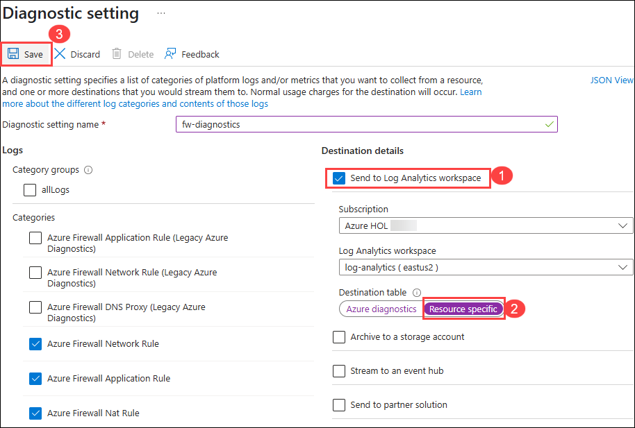

## Task 2: Test IDPS for HTTP traffic

Azure Firewall Premium provides signature-based IDPS to allow rapid detection of attacks by looking for specific patterns, such as byte sequences in network traffic, or known malicious instruction sequences used by malware.

In this task, you will test IDPS for HTTP traffic.

1.  In the Azure portal, from the search bar, search for **Application gateways (1)** and then select **Application gateways (2)**.
 
     
 
1. Select your **Application Gateway**.
 
     
 
1. Select the **Frontend public IP address** of the application gateway.
 
    

1. Copy the **IP address** and save it to Notepad for later use.

    
    
1. On the Azure Portal **Home** page, search for **Firewalls (1)** and then select **Firewalls (2)**.

   
    
1. Click on the **AzureFirewall**.

    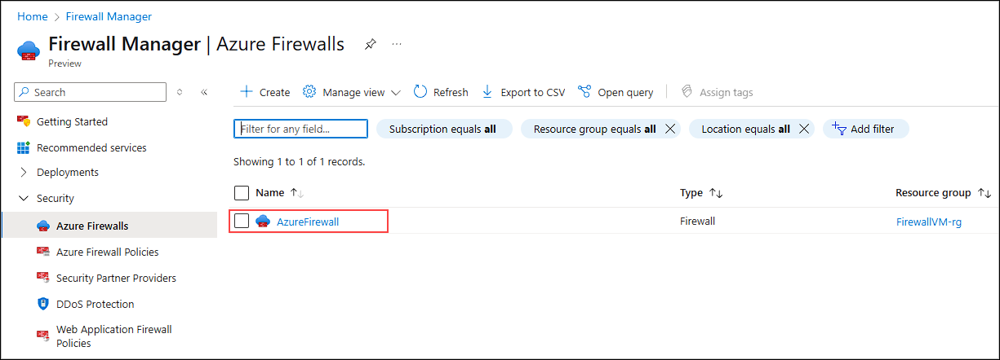
   
1. Select **Firewall Public IP** from the **Overview** tab.

    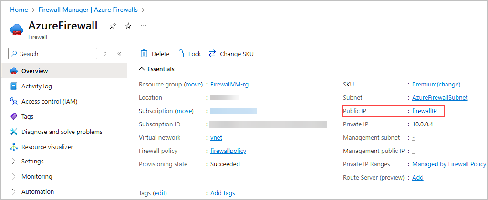
    
1. Copy the **IP address** and save it to Notepad for later use.

    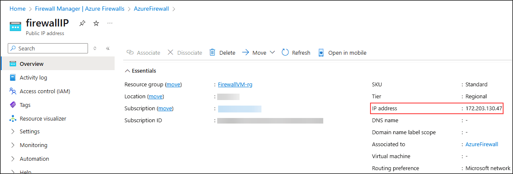  
     
1. Navigate back to Azure Firewall, select **Firewall Manager (1)** from the **Settings** tab, and click **Visit Azure Firewall Manager to configure and manage this firewall (2)**.

   
    
1. Select **Azure Firewall Policies (1)** under **Security**, then click on the firewall policy named **firewallpolicy (2)**.

   
   
1. Select **DNAT rules (1)** from the **Rules** tab on the **Firewall Policy** page, then click **+ Add a rule collection (2)**.

   
    
1. Under the **Add a rule collection** page, enter the details below:

    - Name: **afw-contoso-prod-firewall-rulecolection (1)**
    - Rule Collection type: **DNAT (2)**
    - Priority: **100 (3)**
    - Rule collection group: **DefaultDnatRuleCollectionGroup (4)**
    - Under **Rules (5)** mention the below details:
      - Name: **afw-dnat-http**
      - Source type: Select **IP Address** from the drop-down list
      - Source: Enter *
      - Protocol: Select **TCP** from the drop-down list
      - Destination Ports: **80**
      - Destination (Firewall PIP address): Enter the IP address of the **Firewall** which you copied in step 8.
      - Translated type: Select **IP Address** from the drop-down list
      - Translated address or FQDN: Enter the Public IP address of the **Application gateway** which you copied in step 4.
      - Translated port: **80**
     
     - Click on **Add (6)**.

       

     > **Note:** This may take a few minutes to update the rule collection group. Please wait for the updates to complete before proceeding to the next steps.

1. On the **FirewallVM** virtual machine, search for **Command Prompt (1)** and open the **Command Prompt (2)** window.

   

1. Type the following command at the command prompt:

   - Replace <your web server address> with Firewall IP.

     `curl -A "HaxerMen" <Firewall Public IP>`
 
        
 
 1. In the custom prompt, you will see your Web server response.
 
    
 
 1. Navigate to your **FirewallVM-rg** resource group and select **AzureFirewall**.
 
     
 
1. On the **AzureFirewall** page, select **Logs (1)** under **Monitoring**, then click on **X (2)**.

    

1. Click on **Firewall Logs (Resource Specific Tables - Preview) (1)**, and then click **Run** on **IDPS event logs (2)** to see the logs.
 
    
 
1. After clicking **Run**, you will see resource-specific logs for IDPS events in **Simple Mode**. To switch to **KQL mode**, change the mode from the top right corner.
 
    

    
 
    > **Note:** If you don’t see the logs as expected, it may take up to 6 hours for them to appear. Please refer to the screenshot for reference and continue with the next steps.
 
1. Now navigate back to the firewall policy and under **Settings (1)** select **IDPS (2)**.
 
   
 
1. On the **IDPS** page, select the **Signature rules (1)** tab. Under **Signature ID**, type **2032081 (2)** in the search box.

   

2. Select the **2032081 (1)** signature ID and click **Edit Rules (2)**.

   

3. In the **Edit rules** panel, change the **Signature Mode** to **Alert and Deny (1)** and click **Apply (2)**. Wait for the deployment to complete before proceeding.

   

4. Click **Apply** again to update the firewall policy.

    >**Note:** Wait for a few minutes for the policy to get updated.

1. Navigate back to JumpVM and run the `curl` command again:

    `curl -A "HaxerMen" <Firewall Public IP>`

    Since the HTTP request is now blocked by the firewall, you'll see the following output after the connection timeout expires:

    `curl: (56) Recv failure: Connection was reset`
 
     

> **Congratulations** on completing the task! Now, it's time to validate it. Here are the steps:
> - If you receive a success message, you can proceed to the next task.
> - If not, carefully read the error message and retry the step, following the instructions in the lab guide. 
> - If you need any assistance, please contact us at cloudlabs-support@spektrasystems.com. We are available 24/7 to help you out.

<validation step="e5f9dd50-2ebf-44f8-bcc0-09543bd58111" />

## Task 3: Web categories testing
 
In this task, you will create an application rule to allow access to sports websites.
 
1. In the Azure portal, navigate to your **FirewallVM-rg** resource group and select the Route Table **firewallroute**. 
    
    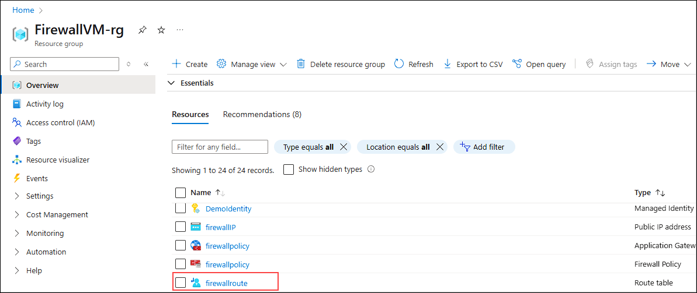
 
1. On the **Route table** page, select **Routes (1)** under **Settings**, then click on **+ Add (2)**.
 
    
 
1. Under the **Add Route** page, enter the following information:
  
    - Route Name: Enter **firewallroute (1)**
    
    - Address prefix destination: Select **IP Addresses (2)** from the drop-down list
    
    - Destination IP address/ CIDR ranges: Enter **0.0.0.0/0 (3)**
    
    - Next hop type: Select **Virtual appliance (4)** from the drop-down list
    
    - Next hop address: Enter the **Private IP Address** of the Firewall **(5)**. 
      
      > **Note**: The **Private IP** address can be found on the **Overview** page of the **AzureFirewall** resource.

      
    
    - Select **Add (6)**
 
      
 
1. Now select **Subnets (1)** under **Settings**, and click on **+ Associate (2)**.

    - Under **Associate subnets**, enter the following details:
   
    - **Virtual Network**: Select **vnet (FirewallVM-rg) (3)** from the drop-down list.
     
    - **Subnet**: Select **FirewallVMSubnet (4)** from the drop-down list.
     
    - Click on **OK (5)**.

      
 
1. Navigate to your **FirewallVM-rg** resource group and select **FirewallVM**. 
 
    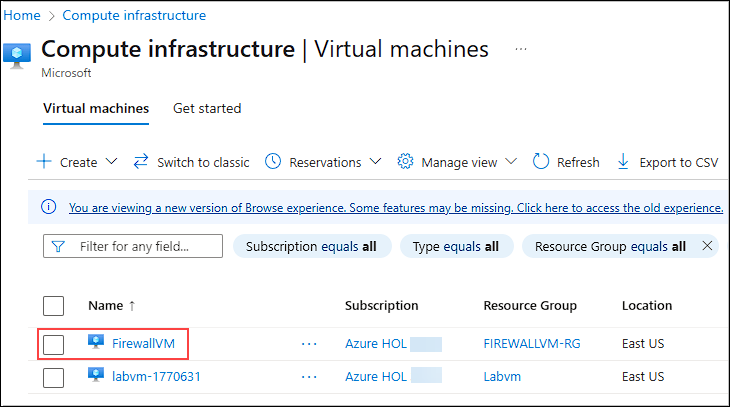

1. On the **FirewallVM Virtual Machine** page, click **Connect (1)** under the **Connect** section, then select **Go to Bastion (2)**.
 
     
 
1. On the Bastion page, follow the instructions below to connect to the Virtual Machine using Bastion:
 
    - **Authentication Type**: Select **VM Password (1)** from the drop-down
    - **Username**: Enter **demouser (2)**
    - **VM Password**: Enter **<inject key="JumpVM Admin Password" enableCopy="true"/> (3)**
    - Click on **Connect (4)**
 
      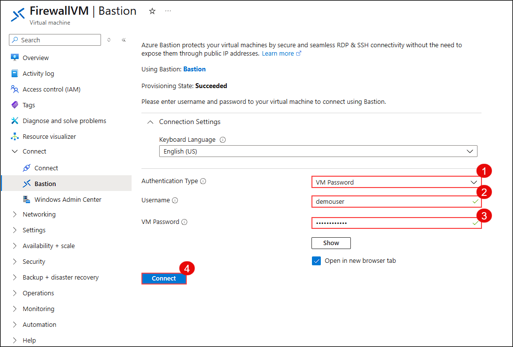
 
1. You will now be redirected to a new tab where the Bastion VM opens. If you see the pop-up **"See text and images copied to the clipboard,"** click on **Allow**.
 
    
 
1. Within the Bastion VM, search for **Edge (1)** and select **Microsoft Edge (2)**.
 
    
 
1. Navigate to the below-mentioned URL, and you can see the error **Hmmm... can't reach this page**.
 
    ```
    https://www.nfl.com
    ```
    
    

    > **Note:** If the copy-paste functionality isn't working directly, click the arrow icon to copy the content to your clipboard, then paste it where needed.
 
    
 
    
 
1. Navigate back to the other tab where the Azure Portal is open.
 
1. In the Azure portal, go to your **FirewallVM-rg** resource group and select **firewallpolicy**.
 
     
 
1. Select **TLS inspection (1)** under the **Settings** tab and enter the below details under the **Key vault** tab:
 
    - Parent policy: Choose **Enabled (2)**
    
    - Managed Identity: Select **(New) fw-cert-id-xxxxxxxxxx  (3)** from the drop-down list
    
    - Key Vault: Select **(New) fw-cert-kv-xxxxxxxxxx (4)** from the drop-down
    
    - Certificate: Select **(New) fw-cert-xxxxxxxxxx (5)** from the drop-down
    
    - Click on **Save (6)**
 
      

      >**Note:** This might take 5-6 minutes to update the firewall policy. Wait for the firewall policy to get updated before proceeding to the next steps.

1. Now, select **Application Rules (1)** from the **Rules** tab on the **Firewall Policy** page, then click **+ Add a rule collection (2)**.
   
    
 
1. Under the **Add a rule collection** page, enter the details below to enable the web application in the Bastion VM:
 
    - Name: **GeneralWeb (1)**
    - Rule Collection type: **Application (2)**
    - Priority: **103 (3)**
    - Rule Collection Action: **Allow**
    - Rule collection group: **DefaultApplicationRuleCollectionGroup (4)**
    - Under **Rules (5)** mention the below details:
      - Name: **AllowSports**
      - Source type: Select **IP Address** from the drop-down list
      - Source: Enter *
      - Protocol: Enter **http,https**
      - TLS inspection: Check TLS inspection
      - Destination Type: Select **Web categories**
      - Destination: Enter `Sports`
     
    - Click on **Add (6)**
 
         

     >**Note:** This might take 5-6 minutes to update the firewall policy. Wait for the firewall policy to get updated before proceeding to the next steps. 
 
1. Once the deployment completes, navigate back to the Bastion VM tab and refresh the page where you browsed to `https://www.nfl.com`. On the Privacy error connection page, click **Advanced**.
 
     
 
1. Click on **Continue to www.nfl.com (unsafe)**.
 
    

    >**Note**: If you have trouble reaching www.nfl.com, try www.nba.com or www.nhl.com.
     
1. Now you can see the NFL web page.
 
    
 
1. Again, navigate to the other tab, where the Azure Portal is opened.
 
1. In the Azure portal, go to your **FirewallVM-rg** resource group and select **AzureFirewall**.
 
     
 
1. On the **AzureFirewall** page, select **Logs (1)** under the **Monitoring** tab, click on **Firewall Logs (Resource Specific Tables - Preview) (2)**, and then click **Run (3)** for **Application rule logs**. Make sure the mode is set to **KQL mode**.
 
     
 
    > **Note:** If you don’t see the logs as expected, it may take up to 6 hours for them to appear. Please refer to the screenshot for reference and continue with the next steps.

     

## Task 4: Implement and Test URL filtering
 
1. Navigate back to the tab where you have opened Bastion VM and browse the below mentioned URL. You can see the error **Hmmm... can't reach this page**.
 
    ```
    www.hindustantimes.com
    ```
 
    
  
1. Switch back to the other tab where the **Azure Portal** is open. In your **FirewallVM-rg** resource group, select **firewallpolicy**.

    

1. Select **Application rules (1)** from the **Rules** tab on the Firewall Policy page, then click **+ Add a rule collection (2)**.
 
    
 
1. Under the **Add a rule collection** page, enter the details below to enable the web application in the Bastion VM:

    - Name: **Firewall-rulecollection (1)**
    - Rule Collection type: **Application (2)**
    - Priority: **107 (3)**
    - Rule Collection Action: **Allow**
    - Rule collection group: **DefaultApplicationRuleCollectionGroup (4)**
    - Under **Rules (5)** mention the below details:
      - Name: **URLFiltering**
      - Source type: Select **IP Address** from the drop-down list
      - Source: Enter *
      - Protocol: Enter **http,https**
      - TLS inspection: Check TLS inspection
      - Destination Type: Select **URL**
      - Destination: Enter `www.hindustantimes.com`
     
     - Click on **Add (6)**
 
         

    > **Note:** This might take 5-6 minutes to update the firewall policy. Wait for the firewall policy to get updated before proceeding to the next steps.     

1. Once the deployment completes, navigate back to the Bastion VM tab and refresh the page where you have browsed for `www.hindustantimes.com`. On the Privacy error connection page, click on **Advanced**.
 
    
 
1. Click on **Continue to www.hindustantimes.com (unsafe)**.
 
    

    > **Note:** The website may take a few moments to load. In the meantime, please proceed with the testing steps and revisit this later towards the end.
 
1. Validate that the HTML response is displayed as expected in the browser.

    

1. Switch to the other tab where the Azure Portal is open.

1. In the Azure portal, go to your **FirewallVM-rg** resource group and select **AzureFirewall**.

    

1. On the **AzureFirewall** page, select **Logs (1)** under the **Monitoring** tab, click on **Firewall Logs (Resource Specific Tables - Preview) (2)**, and click **Run (3)** for **Application rule log**. Ensure the mode is set to **KQL mode** to view the query and results.

    

     > **Note:** If you don’t see the logs as expected, it may take up to 6 hours for them to appear. Please refer to the screenshot for reference and continue with the next steps.

     

## Task 5: IP Groups

1. Navigate to the home page in the Azure portal, search for **IP groups (1)** and select **IP Groups (2)** from suggestions.
 
    
 
1. Click on **+ Create** to create a IP Group.
  
     
 
1. On the **Basics** tab of the **Create an IP Group** page, provide the following details and then click **Next: IP addresses > (4)** to continue.

    | **Setting**      | **Value**                                                    |
    | ---------------- | ------------------------------------------------------------ |
    | Subscription     | Select your subscription.                                    |
    | Resource group   | Select the resource group **FirewallVM-rg (1)**                  |
    | Name             | Enter **IpGroup (2)**                                        |
    | Region           | Select **East US (3)**                                       |
 
     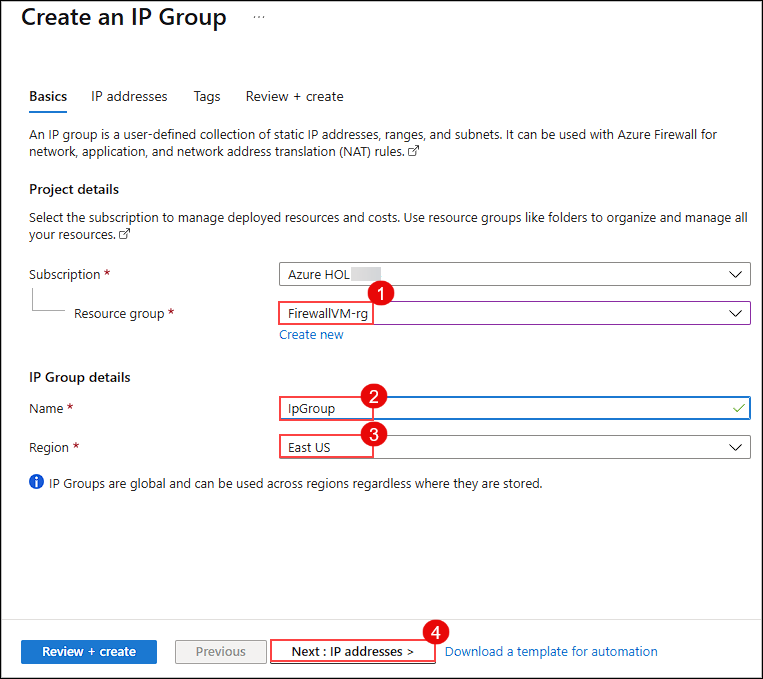

1. On the **IP addresses** tab, enter `*` in the **IP address, range or subnet (1)** field and then click **Review + create (2)**.
 
    
 
1. Review the Summary, and then select **Create**.
 
    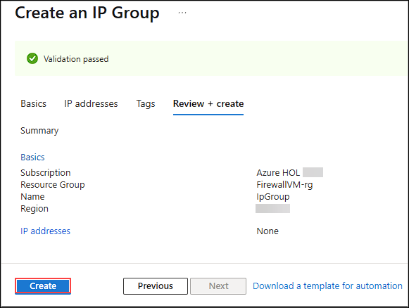

1. Navigate back to the tab where you have opened Bastion VM and browse the below mentioned URL. You can see the error **Action Deny**.
 
    ```
    www.news18.com
    ```
 
    
  
1. Now switch back to the other tab, where Azure Portal is opened and to your **FirewallVM-rg** resource group, then select **firewallpolicy**.
 
    
 
1. Select **Application rules (1)** from **Rules** section on Firewall Policy page and select **+ Add a rule collection (2)**.
 
    

1. Under the **Add a rule collection** page, enter the details below to enable the web application in the Bastion VM:

    - Name: **Ipgroup-rule (1)**
    - Rule Collection type: **Application (2)**
    - Priority: **104 (3)**
    - Rule collection action: **Allow (4)**
    - Rule collection group: **DefaultApplicationRuleCollectionGroup (5)**
    - Under **Rules (6)** mention the below details:

        - Name: **URL-Ipgroup**
        - Source type: Select **IP Group** from the drop-down list
        - Source: Enter **Ipgroup**
        - Protocol: Enter **http,https**
        - TLS inspection: Check TLS inspection
        - Destination Type: Select **URL**
        - Destination: Enter `www.news18.com`
    - Click on **Add (7)**
 
        

        >**Note:** This might take 5-6 minutes to update the firewall policy. Wait for the firewall policy to get updated before proceeding to the next steps.

1. Once the deployment completes, navigate back to the Bastion VM tab and refresh the page where you have browsed for `www.news18.com`. On the Privacy error connection page, click on **Advanced**.
 
    
 
1. Click on **Continue to www.news18.com (unsafe)**.
 
    

1. Now, you validate that the HTML response is displayed as expected in the browser.
 
     
 
## Task 6: Azure Firewall Policies with Firewall Manager (Optional)

### Task 6.1: Create a Firewall Policy

1. Navigate to the home page in the Azure portal, search for **Firewall Manager (1)** and select **Firewall Manager (2)** from suggestions.
 
     
 
1. On the Firewall Manage page, navigate to **Azure Firewall Policies (1)** under Security and click on **+ Create Azure Firewall Policy (2)**. 

      

1. On the **Basics** tab of Azure Firewall Policy page, enter or select the following information and click on **Next: DNS Settings > (6)**.
 
    | **Setting**      | **Value**                                                    |
    | ---------------- | ------------------------------------------------------------ |
    | Subscription     | Select your subscription **(1)**.                                    |
    | Resource group   | Select the resource group **FirewallVM-rg (2)**                  |
    | Name             | Enter **policy-01 (3)**                                      |
    | Region           | Select **East US (4)**                                       |
    | Policy tier      | Select **Standard (5)**                                      |
 
     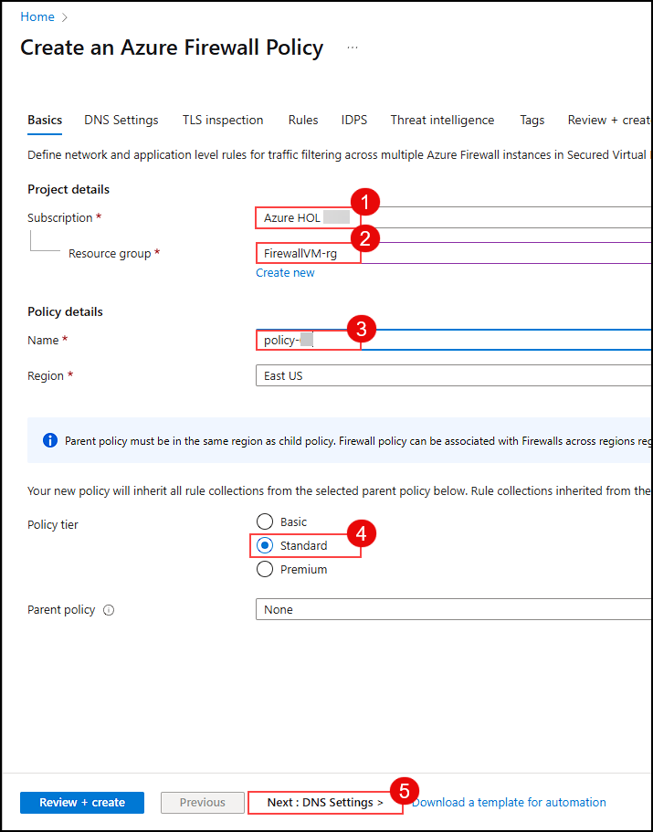
 
1. On the **DNS Settings** tab, leave it as default and click on **Next : TLS inspection >**.
 
    
 
1. On the **TLS inspection** tab, leave it as default and click on **Next : Rules >**.
 
    

1. On the **Rules** tab, select **+ Add a rule collection**.

    
 
1. On the **Add a rule collection** page, enter or select the following information
 
    - Name: **App-RC-01 (1)**
    - Rule Collection type: **Network (2)**
    - Priority: **100 (3)**
    - Rule collection action: **Allow (4)**
    - Under **Rules (5)** mention the below details:
      - Name: Enter **AllowWeb**
      - Source type: Select **IP Address** from the drop-down list
      - Source: Enter **192.168.1.0/24**
      - Protocol: Select **TCP**
      - Destination Ports: **80**
      - Destination Type: Select **IP Address**
      - Destination: Enter **10.6.0.0/16**

    - On the next rule row, enter the following information:

      - Name: Enter **AllowRDP**
      - Source type: Select **IP Address** from the drop-down list
      - Source: Enter **192.168.1.0/24**
      - Protocol: Select **TCP**
      - Destination Ports: **3389**
      - Destination Type: Select **IP Address**
      - Destination: Enter **10.6.0.0/16**
      
    - Click on **Add (6)**
 
      
 
1. Select **Review + create**.
 
    
 
1. Review the Summary page and then select **Create**.
 
    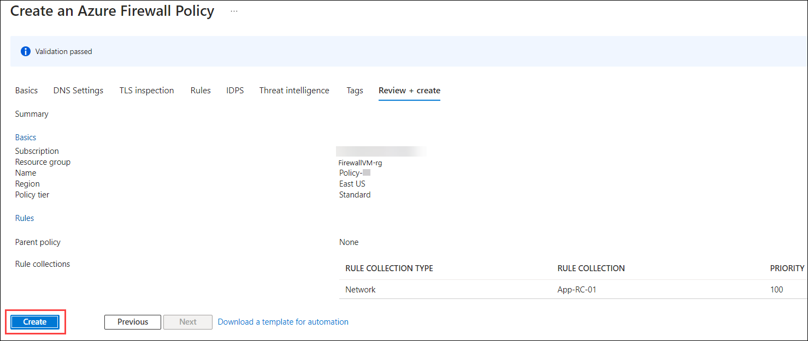
 
### Task 6.2: Create the firewall hub virtual network
 
1. Navigate to the home page in the Azure portal, search for **Firewall Manager (1)** and select **Firewall Manager (2)** from suggestions.
 
    
 
1. On the Firewall Manger page, navigate to **Virtual Hubs (1)** under Deployments section and click **+ Create new secured virtual hub (2)**.
 
    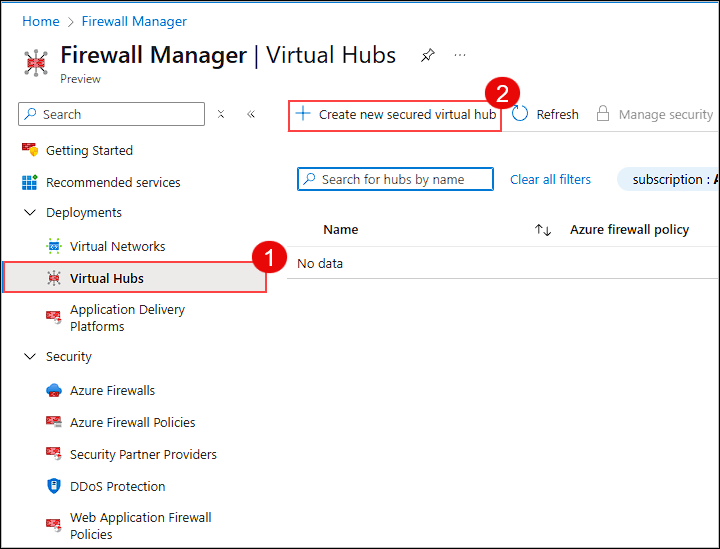

1. On the **Basics** tab of secured virtual hub page, enter or select the following information and click on **Next: Azure Firewall > (8)**.
   
     | **Setting**                                   | **Value**                                                    |
     | ----------------------------------------------| ------------------------------------------------------------ |
     | Subscription                                  | Select your subscription.                                    |
     | Resource group                                | Select the resource group **FirewallVM-rg (1)**                  |
     | Region                                        | Select **East US (2)**                                       |
     | Secured virtual hub name                      | Enter **Hub-01 (3)**                                         |
     | Hub address space                             | Enter **10.2.0.0/16 (4)**                                    |
     | Choose an existing vWAN or create a new one   | Choose **New vWAN (5)**                                      |
     | Virtual WAN Name                              | Enter **Vwan-01 (6)**                                        |
     | Type                                          | Select **Standard (7)**                                      |

      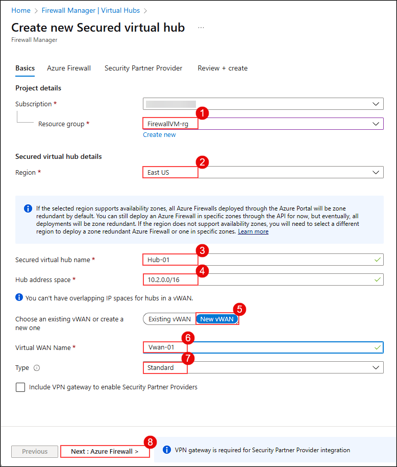

1. On the **Azure Firewall** tab, enter or select the following information and click on **Next: Security Partner Provider > (4)**

     | **Setting**                                   | **Value**                                                    |
     | ----------------------------------------------| ------------------------------------------------------------ |
     | Azure Firewall tier                           | **Standard (1)**                                             |
     | Specify number of Public IP addresses         | **1 (2)**                                                    |
     | Subscription                                  | Select your default subscription **(3)**                     |

     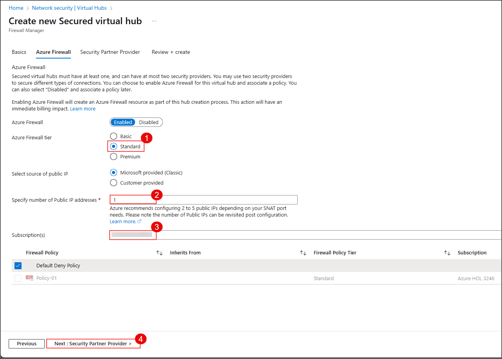
 
1. On the **Security Partner Provider** tab, leave it to default and click on **Next: Review + create >**.
 
    

1. Review the **Summary** page and select **Create**.  
  
    

    >**Note**: Deployment may take up to 30 minutes to complete.
 
### Task 6.3: Associate the firewall policy with the virtual hub

1. Navigate to the home page in the Azure portal, search for **Fireall Manager (1)** and select **Fireall Manager (2)** from suggestions.
 
    
  
1. On the Fireall Manager page, under **Deployments** section, click on **Virtual Hubs**.
  
    
 
1. Select the checkbox for **Hub-01 (1)**, click on **Manage security (2)**, and then choose **Choose another firewall policy (3)**.

    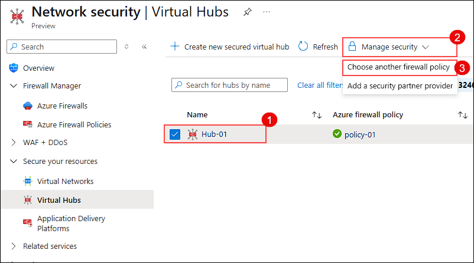

2. On the **Choose another firewall policy** page, select the checkbox for **Policy-01 (1)** and click **Next: Review + confirm > (2)**.

    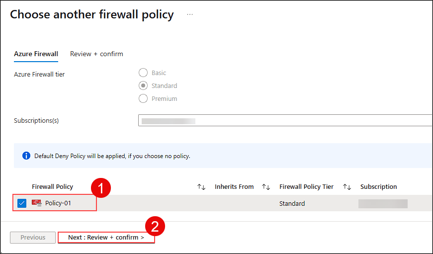

3. On the next page, click **Confirm** to associate hub-01 with policy-01.

    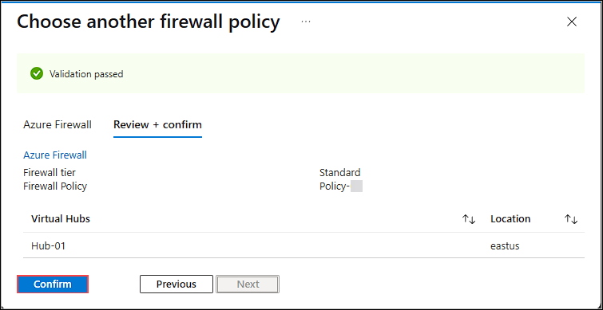

4. Return to the Virtual Hubs section, click on Hub-01, and you will see that the Azure Firewall status is marked as **Secured**.

    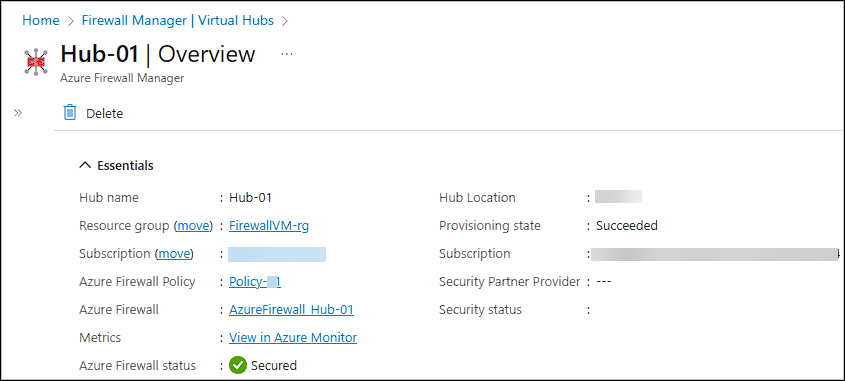
    
> **Congratulations** on completing the task! Now, it's time to validate it. Here are the steps:
> - If you receive a success message, you can proceed to the next task.
> - If not, carefully read the error message and retry the step, following the instructions in the lab guide. 
> - If you need any assistance, please contact us at cloudlabs-support@spektrasystems.com. We are available 24/7 to help you out.

<validation step="659469d6-4b83-467d-a4ce-83adf7dc61ba" />

## Summary
 
In this exercise, you have covered the following:
  
- Added firewall diagnostics settings 
- Tested IDPS for HTTP traffic
- Performed Web category testing 
- Implemented and tested URL filtering
- Performed IP groups
- Performed Azure Firewall Policies with the Firewall Manager

### Click on **Next >>** to proceed with next exercise.
